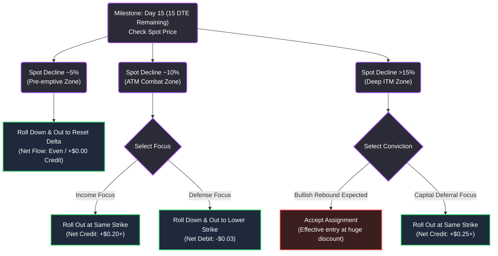

# Modern Quantitative & Fundamental Asymmetry Playbook
**Authors:** Antigravity (Advanced Agentic Coding Team, Google DeepMind)  
**Target Audience:** Elite Multi-Strategy Allocators & Quantitative Portfolio Managers  

---

## Executive Summary

This playbook documents a proprietary, production-grade quantitative allocation, risk mitigation, and capital execution framework. By integrating **multi-temporal price-path asymmetry modeling ($MHC\_QAS$)** with **incremental data pipeline engineering**, **Warren Buffett-style owner's earnings screens**, and **volatility-skew option execution**, this system systematically isolates high-conviction, asset-light compounders while capturing rich annualized yields on defensive entries.

```
                      ┌────────────────────────────────────────┐
                      │    1. Incremental Ingestion Engine     │
                      │  (Daily Caching & Liquidity Filter)    │
                      └───────────────────┬────────────────────┘
                                          ▼
                      ┌────────────────────────────────────────┐
                      │     2. Multi-Horizon Quant Engine      │
                      │  (MHC_QAS Price-Path Asymmetry Math)   │
                      └───────────────────┬────────────────────┘
                                          ▼
                      ┌────────────────────────────────────────┐
                      │    3. Owner's Earnings & Debt Screen   │
                      │     (Negative Net Debt / FCF > 10%)    │
                      └───────────────────┬────────────────────┘
                                          ▼
                      ┌────────────────────────────────────────┐
                      │    4. Option Premium execution (DTE)   │
                      │   (Delta 0.15-0.23, IV Skew Capture)   │
                      └───────────────────┬────────────────────┘
                                          ▼
                      ┌────────────────────────────────────────┐
                      │    5. Tactical Rolling Decision Tree   │
                      │       (Active Calendar Delta Rolls)    │
                      └────────────────────────────────────────┘
```

---

## 1. The Incremental Data Ingestion Engine (`run_daily_pipeline.py`)

To eliminate Lookback Bias and avoid API rate limits, the ingestion engine implements a robust, two-tier cache update architecture:

### A. Incremental Price Matrix Caching
Instead of redownloading gigabytes of historical data every day, the pipeline loads an existing `daily_prices.csv` cache (currently ~37MB) and detects the last recorded timestamp ($T_{last}$). If $T_{today} > T_{last}$, the engine executes an incremental slice request via `yfinance`:
```python
new_prices = yf.download(tickers, start=start_date, end=today, progress=False)['Adj Close']
```
This data is aligned, concatenated, and saved back to the database.

### B. Ingestion Safeguards & Liquidity Filtering
1. **Average Daily Volume (ADV) Filter:** To protect the database from low-float, illiquid micro-caps, we calculate a rolling volume matrix:
   $$\text{ADV}_{i} = \frac{1}{N}\sum_{t=1}^N \text{Volume}_{i, t} > 100,000\text{ shares}$$
   This screens out 3,371 tickers down to 3,228 highly liquid securities, avoiding rate-limiting penalties on stale counters.
2. **Dynamic Horizon Clamping:** Historical indexes sometimes contain short series. The engine dynamically clamps horizons to the maximum available return length to prevent index out-of-bounds crashes:
   $$H_{actual} = \min(H_{target}, \text{len}(R_{t}))$$
   This prevents crashes and ensures continuity across all listings.

---

## 2. Mathematical Foundation of Multi-Horizon Asymmetry ($MHC\_QAS$)

Standard price momentum suffers from serious time-dependence errors. To capture genuine trend acceleration, we calculate the rolling 3-month (63 trading days) percentage returns:
$$R_{i, t} = \frac{P_{i, t} - P_{i, t-63}}{P_{i, t-63}}$$

We evaluate this return distribution across four concentric historical windows $H \in \{0.5\text{y}, 1.0\text{y}, 2.0\text{y}, 2.5\text{y}\}$ (mapped to 126, 252, 504, and 625 trading days respectively):

```
                   ┌──────────────────────────────────────────────┐
                   │ 2.5-Year Full Baseline (625 Days - 10% Wt)   │
                   │  ┌────────────────────────────────────────┐  │
                   │  │ 2.0-Year Long-Term (504 Days - 20% Wt) │  │
                   │  │  ┌──────────────────────────────────┐  │  │
                   │  │  │ 1.0-Year Mid-Term (252 Days - 30% Wt)│  │  │
                   │  │  │  ┌────────────────────────────┐  │  │  │
                   │  │  │  │0.5-Year Near-Term (126 Days│  │  │  │
                   │  │  │  │     (40% Weight)           │  │  │  │
                   │  │  │  └────────────────────────────┘  │  │  │
                   │  │  └──────────────────────────────────┘  │  │  │
                   │  └────────────────────────────────────────┘  │
                   └──────────────────────────────────────────────┘
```

For each window $H$, we calculate three core statistical markers:

### A. Average Drift ($\mu_{H}$)
$$\mu_{H} = \frac{1}{H} \sum_{t \in H} R_t$$

### B. Quantile Asymmetry Ratio ($AR_{H}$)
Measures the ratio of positive tail surprises (90th percentile) to negative tail surprises (10th percentile) relative to the mean:
$$AR_{H} = \frac{Q_{90}(R_{t}) - \mu_{H}}{\mu_{H} - Q_{10}(R_{t})}$$
*   $AR_{H} > 1.0$: Strong positive right-skew (highly asymmetric upside).
*   $AR_{H} < 1.0$: Dangerous left-skew (heavy fat-tailed downside risk).

### C. Gain-to-Pain Ratio ($GPR_{H}$)
Measures absolute price-path efficiency (upside return volume vs. downside return volume):
$$GPR_{H} = \frac{\sum R_t^+}{\max\left(\sum |R_t^-|, 10^{-4}\right)}$$

### D. Dampened Quantile Asymmetry Score ($QAS_{H}$)
We apply a natural logarithmic compressor to the $GPR$ to prevent hyper-volatile meme-stocks or illiquid outliers from overwhelming structural compounding winners:
$$QAS_{H} = \mu_{H} \times AR_{H} \times \ln(1 + GPR_{H})$$

### E. Multi-Horizon Consolidated Score ($MHC\_QAS$)
We consolidate the horizon scores using our weighted decay model to prioritize near-term acceleration while heavily anchoring long-term structural persistence:
$$MHC\_QAS = 0.40 \, QAS_{0.5\text{y}} + 0.30 \, QAS_{1.0\text{y}} + 0.20 \, QAS_{2.0\text{y}} + 0.10 \, QAS_{2.5\text{y}}$$

---

## 3. Fundamental Fortress Quality & Owner's Earnings

A high-ranking $MHC\_QAS$ score represents momentum, but is vulnerable to value traps. We apply **Warren Buffett's Owner's Earnings and Net-Net overrides** to filter the top leaders:

### A. Owner's Earnings (FCF Margin)
We prioritize companies that convert gross revenues into high levels of discretionary cash flow:
$$\text{FCF Margin} = \frac{\text{Free Cash Flow}}{\text{Total Revenue}} \ge 10\%$$

### B. Balance Sheet Net-Net Overrides
To capture deep value asymmetries, we calculate the Enterprise Value ($EV$):
$$EV = \text{Market Cap} + \text{Total Debt} - \text{Total Cash}$$
If $EV < 0$ (Net-Net balance sheet cushion), it triggers an **immediate buy-in override**, as the net-cash cushion completely covers the cost of acquiring the business.

### C. Case Comparison: DECK vs. CROX vs. URBN (3-Year Trailing Profiles)

*   **Deckers Outdoor (DECK) - Premium Compounder:**
    *   **Net Margin Trend:** Expanded from 14.1% to 19.3%.
    *   **FCF Margin:** Highly stable at ~18.2%.
    *   **Balance Sheet:** Extreme cash buffer (Net Cash grew from $735M to $1.61B; Net Debt $= -$1.61B).
    *   **Asset Lightness:** Highly outsourcing model, excellent ROIC.
*   **Crocs (CROX) - Leveraged Value Trap:**
    *   **Net Margin Trend:** Stable around 18.5%.
    *   **FCF Margin:** Highly organic at ~16.8%.
    *   **Balance Sheet:** Severely dragged by debt (Net Debt $= +$1.48B). Highly leveraged, leaving zero margin for consumer demand shifts.
*   **Urban Outfitters (URBN) - Capital Heavy Retail:**
    *   **Net Margin Trend:** Low margin cap at ~7.5%.
    *   **FCF Margin:** Low at ~5.3% due to high brick-and-mortar capital expenditures.
    *   **Balance Sheet:** Carrying -$850M Net Debt, highly exposed to commercial real estate leases.

---

## 4. Technical Skew & Option Yield Optimization

When a high-quality compounder undergoes a macro correction, panic expands the options' **Implied Volatility (IV)**. We exploit this volatility skew to secure extremely discounted entry targets or pocket massive annualized cash yields:

```
               Spot Price
                  │
                  ▼
         [ Weekly Lower Bollinger Band ]  ◄─── Major Institutional Support Floor
                  │
                  ▼
         [ Macro Double Bottom Wicks ]    ◄─── Liquidity Sweep & Seller Exhaustion Zone
                  │
                  ▼
         [ Safe Options Strike Zone ]     ◄─── Delta: 0.15 to 0.23 (Target Sweet Spot)
```

### A. Core Option Rules
1. **Time-to-Expiration (DTE):** Select **30 to 45 Days to Expiration (DTE)**. This targets the steepest inflection of the Theta (time) decay curve.
2. **Delta Range:** Target a **Delta of 0.15 to 0.23** (approx. 80-85% probability of expiring out-of-the-money).
3. **Bollinger Band & Wicks Alignment:** Strike must sit at or below the **Weekly Lower Bollinger Band** and align with **historical macro double-bottom wick-lows** (e.g., $195.00 Put for EXPE, $13.50 Put for ETHA).

### B. Option Valuation and Greeks Model (Black-Scholes-Merton)
$$\text{Premium} (C_0, P_0) = \mathbf{BSM}(S, K, r, \sigma, T)$$
We scale option yield expectations by the **Median Growth Factor** over the horizon:
$$\text{Expected Price Drift} = P_0 \times (1 + r_{50})$$
This allows the allocator to write cash-secured puts with absolute quantitative conviction.

---

## 5. Advanced Option Rolling Rules (ATM and Calendar Rolls)

If the market undergoes a severe flush and the cash-secured put approaches the money, the allocator executes a strict, systematic defensive playbook on the **15 DTE boundary**:

### Tactical Option Rolling Matrix

| Trigger | Spot Decline | Tactical Action | Financial Net-Flow | Rationale |
| :--- | :--- | :--- | :--- | :--- |
| **Zone 1: Pre-emptive** | ~5% Decline | Roll **Down & Out** to a lower strike (30 DTE extension) | Even Roll / Minor Credit ($\ge +\$0.00$) | Resets Delta back to $\le 0.20$ early, preventing gamma squeeze. |
| **Zone 2: ATM Combat** | ~10% Decline (At-The-Money) | **Option A (Income):** Roll **Out** at same strike to 30 DTE.<br>**Option B (Defense):** Roll **Down & Out** to lower strike. | **Option A:** Rich Net Credit ($+\$0.20$ to $+\$0.40$)<br>**Option B:** Small Net Debit ($-\$0.03$) | Pocket large premium expansion or pay a tiny debit to push the entry commitment $0.50 lower. |
| **Zone 3: Deep ITM** | $>15\%$ Decline (In-The-Money) | **Option A (Assign):** Accept Assignment.<br>**Option B (Defer):** Roll **Out** at same strike to 45 DTE. | **Option A:** Capital Outlay (100% assignment)<br>**Option B:** Massive Net Credit ($+\$0.25$ to $+\$0.50$) | Accept the asset at a deep discount, or extend the runway to defer cash assignment while building premium cushions. |

### Rolling Decision Tree



---

## 6. CLI Command Reference & Executable Demos

The platform is designed for rapid execution and analysis across the workspace. Use these commands to replicate our quantitative findings:

### A. Run the Incremental Daily Ingestion & Screening Pipeline
This updates the price cache matrix, filters for highly active liquid tickers, ranks them by $MHC\_QAS$, generates a leaderboard CSV, and exports a 6-month cumulative performance chart of the top leaders:
```bash
python scripts/run_daily_pipeline.py
```
*   **Leaderboard Output:** `outputs/daily_pipeline_leaderboard.csv`
*   **Performance Chart:** `outputs/asymmetry_leaders_performance.png`

### B. Analyze Stock Fundamentals & Balance Sheet Margins
Evaluate any ticker's trailing margin trends, cash position, capital lightness, and owner's earnings profile (e.g., DECK):
```bash
python scripts/analyze_stock.py --ticker DECK
```

### C. Calculate Option Yields and Black-Scholes Greeks
Find the premium yield, annualized return, Delta, Gamma, Theta, and Vega for any cash-secured put position:
```bash
python scripts/analyze_options.py --ticker EXPE --strike 195.00 --dte 45 --iv 0.509
```

### D. Analyze Multi-Ticker 3-Year Trailing Financial Trends
Compare multiple stocks simultaneously to evaluate margins, debt levels, and cash flow stability side-by-side:
```bash
python scripts/analyze_trends.py --tickers DECK,ANF,URBN,CROX
```
